# gitdaq 📈

**Your GitHub contributions, traded like a stock.**

gitdaq renders your GitHub activity as a **candlestick (K-line) chart** — right
on your profile README. Red means you "rallied" (more than yesterday), green
means you "sold off". Chinese A-share color convention, and a Xueqiu-style
terminal layout: **BOLL(20,2) bands** and an **MA7 line** over the candles,
and a **volume pane with MA5/MA10** — plus period high/low callouts, the
whole trading-app look.

<picture>
  <source media="(prefers-color-scheme: dark)" srcset="https://raw.githubusercontent.com/Grimnirobser/Grimnirobser/main/kline/kline-dark.svg">
  
</picture>

*Live demo above — regenerated daily from [@Grimnirobser](https://github.com/Grimnirobser)'s
contribution calendar by this very action.*

## Put it on your profile

1. In your profile repository (`<username>/<username>`), create
   `.github/workflows/kline.yml`:

   ```yaml
   name: kline
   on:
     schedule:
       - cron: "17 0 * * *"   # daily; pick any time
     workflow_dispatch:
   permissions:
     contents: write
   jobs:
     kline:
       runs-on: ubuntu-latest
       steps:
         - uses: actions/checkout@v4
         - uses: Grimnirobser/gitdaq@v1
         - name: Commit chart
           run: |
             git config user.name "github-actions[bot]"
             git config user.email "41898282+github-actions[bot]@users.noreply.github.com"
             git add kline
             git diff --cached --quiet || git commit -m "chore: refresh kline chart"
             git push
   ```

2. Add the chart to your `README.md`:

   ```html
   <picture>
     <source media="(prefers-color-scheme: dark)" srcset="kline/kline-dark.svg">
     
   </picture>
   ```

3. Run the workflow once from the Actions tab (or wait for the cron) — done.

### Chart a repository instead

Put the same workflow in **any repo** and pass `repo:` — the chart then shows
that repository's pulse (candles = daily commits by everyone on the default
branch, volume = lines changed), perfect for a project README:

```yaml
- uses: Grimnirobser/gitdaq@v1
  with:
    repo: ${{ github.repository }}
```

For a **popularity chart** instead, add `metric: stars` — candles become
**new stars per day** (close = today's intake, open = yesterday's; red =
hype accelerating) and volume becomes **new forks per day**. Daily gains
are tracked by diffing star/fork totals against a `.stars.json` baseline
kept next to the SVGs (commit it), with a one-time paginated backfill of
recent history on the first run.

### Action inputs

| Input | Default | Meaning |
|---|---|---|
| `user` | repo owner | GitHub username to chart |
| `repo` | — | Chart a **repository** instead (`OWNER/NAME`): candles = daily commits on the default branch (all authors), volume = lines changed. Overrides `user` |
| `github_token` | `github.token` | Default token sees **public** contributions; pass a PAT with `read:user` to include private counts |
| `metric` | `contributions` | `contributions`: candles = daily total contributions. `commits`: candles = daily **commits**, volume = contributions. `lines`: candles = contributions, volume = **lines of code changed** (adds + deletes on default branches). `stars` (with `repo:` only): candles = **new stars/day**, volume = **new forks/day** — keeps a `.stars.json` baseline next to the SVGs, commit it along |
| `days` | `60` | Recent active days to plot (`0` = entire history) |
| `lang` | `en` | Chart labels: `en` or `zh` |
| `output_dir` | `kline` | Where `kline-light.svg` / `kline-dark.svg` are written |

## How the OHLC is defined (honest data, no invented wicks)

The "price" is your **daily contribution count** (same data as the green
heatmap: commits + PRs + issues + reviews, via the GraphQL contribution
calendar).

| Element | Meaning |
|---|---|
| Close | today's contribution count |
| Open | yesterday's contribution count |
| Rise / fall | did you do more or less than yesterday |
| Volume | contribution count, as bars |
| No-activity days | skipped, like non-trading days; comebacks gap like a resumed stock |

The calendar is day-granular, so profile candles have no wicks — we'd rather
draw no wick than a fabricated one. Up candles are hollow, down candles are
filled, so direction never relies on color alone (red-green colorblind safe;
palette CVD-validated).

With `metric: commits` the candles switch to **daily commits** (GitHub
attribution rules: default-branch commits, linked author email) while the
volume bars keep showing total contributions — commit price action on top,
overall market activity below.

With `metric: lines` the candles stay on contributions and the volume bars
show **lines of code changed** per day (additions + deletions of your
authored commits on each repo's default branch) — price action on top, how
much code actually moved below. Same attribution rules as commits.

## Local analysis mode (interactive HTML)

The same script doubles as a local tool with crosshair tooltips, range
switching and a data table. Here the price is the **rolling 24-hour count of
file modifications** (one file changed in one commit = 1 event), which has
real intraday extremes — so these candles *do* have honest wicks:
open = yesterday's total (the window value at midnight), close = today's
total, high/low = the window's intraday extremes.

```bash
python3 kline.py /path/to/repo --open             # any local git repo → HTML
python3 kline.py --github <user> --open           # your whole GitHub account → HTML
python3 kline.py --github-repo owner/name --open  # a GitHub repo's pulse → HTML
python3 kline.py --github <user> --svg out/       # the profile SVGs, locally
python3 kline.py --selftest                       # built-in checks
```

Zero dependencies: Python 3 stdlib only; SVG/HTML are self-contained.
(`--github` needs an authenticated [GitHub CLI](https://cli.github.com/) when
run locally; inside Actions the runner's `gh` + workflow token are used.)

## The GITDAQ-20 index

What the **NASDAQ-100** is to stocks, the **GITDAQ-20** is to GitHub: the 20
most-starred repositories on the exchange, one candlestick chart each —
candles = **new stars per day**, volume = **new forks per day** —
reconstituted and re-charted daily by
[CI](.github/workflows/showcase.yml). Full-size charts with descriptions:
[showcase/](showcase/README.md).

<!-- GDQ20:START -->
<!-- GDQ20:v6550444 -->
**^GDQ20 &nbsp;6,550,444** ▲ +4,469 (+0.07%) · close 2026-07-11 · [constituent detail →](showcase/README.md)

<table>
<tr>
<td valign="top" width="50%">
<b>01 · <a href="https://github.com/codecrafters-io/build-your-own-x">codecrafters-io/build-your-own-x</a></b> — ★ 524,143<br>
<picture>
  <source media="(prefers-color-scheme: dark)" srcset="showcase/codecrafters-io-build-your-own-x/kline-dark.svg">
  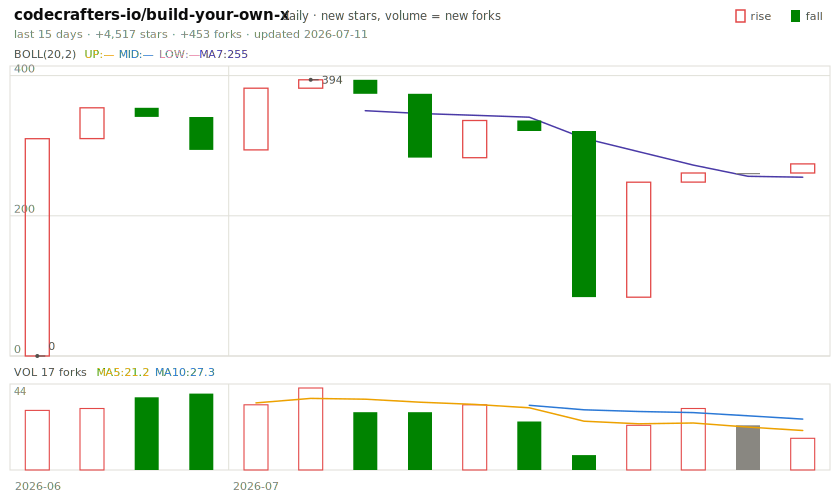
</picture>
</td>
<td valign="top" width="50%">
<b>02 · <a href="https://github.com/sindresorhus/awesome">sindresorhus/awesome</a></b> — ★ 483,773<br>
<picture>
  <source media="(prefers-color-scheme: dark)" srcset="showcase/sindresorhus-awesome/kline-dark.svg">
  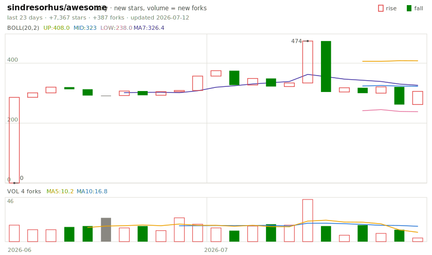
</picture>
</td>
</tr>
<tr>
<td valign="top" width="50%">
<b>03 · <a href="https://github.com/freeCodeCamp/freeCodeCamp">freeCodeCamp/freeCodeCamp</a></b> — ★ 451,538<br>
<picture>
  <source media="(prefers-color-scheme: dark)" srcset="showcase/freeCodeCamp-freeCodeCamp/kline-dark.svg">
  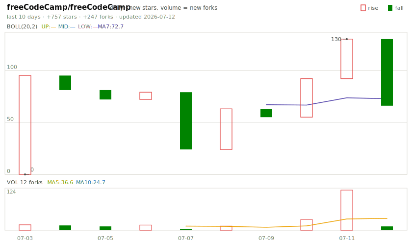
</picture>
</td>
<td valign="top" width="50%">
<b>04 · <a href="https://github.com/public-apis/public-apis">public-apis/public-apis</a></b> — ★ 448,724<br>
<picture>
  <source media="(prefers-color-scheme: dark)" srcset="showcase/public-apis-public-apis/kline-dark.svg">
  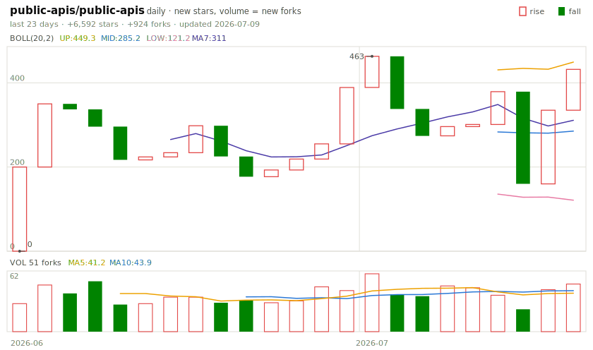
</picture>
</td>
</tr>
<tr>
<td valign="top" width="50%">
<b>05 · <a href="https://github.com/EbookFoundation/free-programming-books">EbookFoundation/free-programming-books</a></b> — ★ 391,615<br>
<picture>
  <source media="(prefers-color-scheme: dark)" srcset="showcase/EbookFoundation-free-programming-books/kline-dark.svg">
  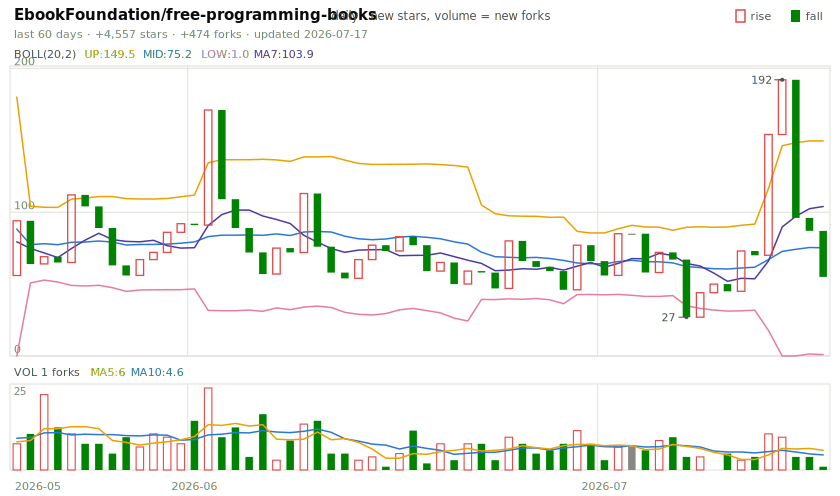
</picture>
</td>
<td valign="top" width="50%">
<b>06 · <a href="https://github.com/openclaw/openclaw">openclaw/openclaw</a></b> — ★ 382,530<br>
<picture>
  <source media="(prefers-color-scheme: dark)" srcset="showcase/openclaw-openclaw/kline-dark.svg">
  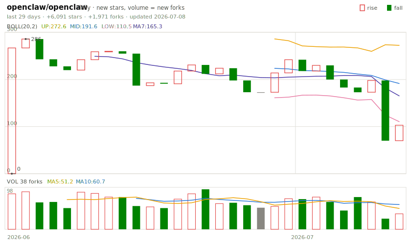
</picture>
</td>
</tr>
<tr>
<td valign="top" width="50%">
<b>07 · <a href="https://github.com/nilbuild/developer-roadmap">nilbuild/developer-roadmap</a></b> — ★ 360,327<br>
<picture>
  <source media="(prefers-color-scheme: dark)" srcset="showcase/nilbuild-developer-roadmap/kline-dark.svg">
  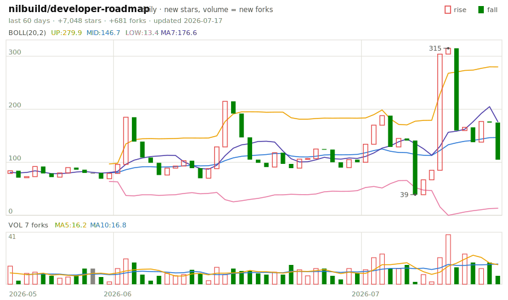
</picture>
</td>
<td valign="top" width="50%">
<b>08 · <a href="https://github.com/donnemartin/system-design-primer">donnemartin/system-design-primer</a></b> — ★ 357,015<br>
<picture>
  <source media="(prefers-color-scheme: dark)" srcset="showcase/donnemartin-system-design-primer/kline-dark.svg">
  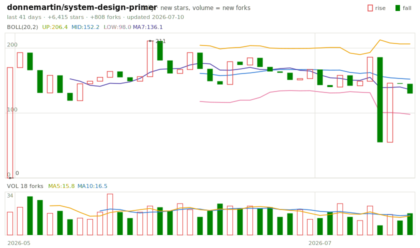
</picture>
</td>
</tr>
<tr>
<td valign="top" width="50%">
<b>09 · <a href="https://github.com/jwasham/coding-interview-university">jwasham/coding-interview-university</a></b> — ★ 355,826<br>
<picture>
  <source media="(prefers-color-scheme: dark)" srcset="showcase/jwasham-coding-interview-university/kline-dark.svg">
  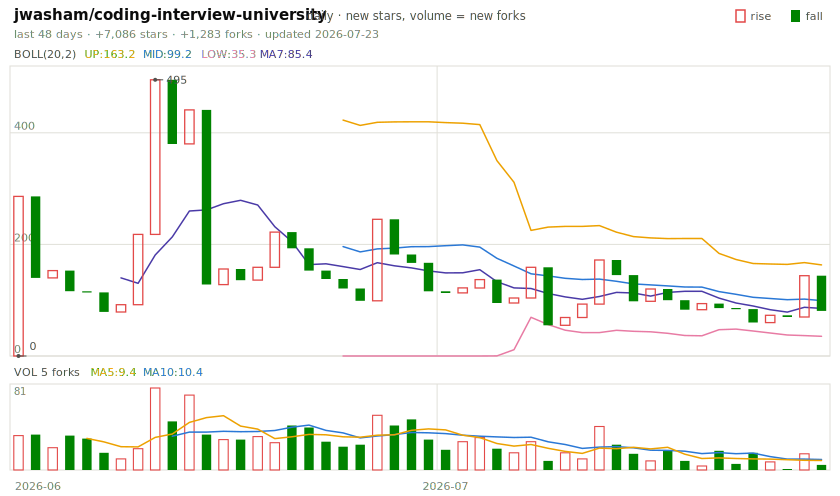
</picture>
</td>
<td valign="top" width="50%">
<b>10 · <a href="https://github.com/vinta/awesome-python">vinta/awesome-python</a></b> — ★ 307,454<br>
<picture>
  <source media="(prefers-color-scheme: dark)" srcset="showcase/vinta-awesome-python/kline-dark.svg">
  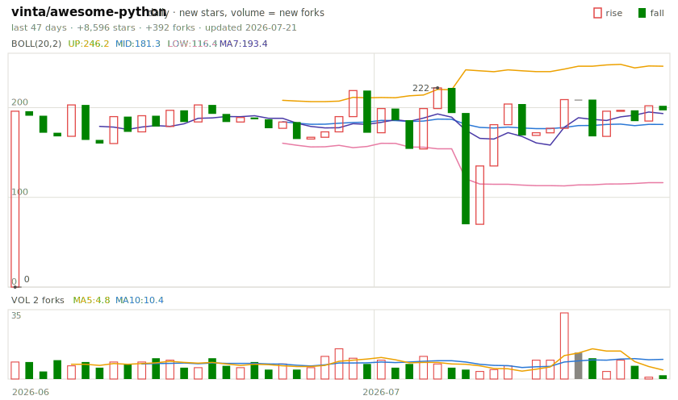
</picture>
</td>
</tr>
<tr>
<td valign="top" width="50%">
<b>11 · <a href="https://github.com/awesome-selfhosted/awesome-selfhosted">awesome-selfhosted/awesome-selfhosted</a></b> — ★ 304,493<br>
<picture>
  <source media="(prefers-color-scheme: dark)" srcset="showcase/awesome-selfhosted-awesome-selfhosted/kline-dark.svg">
  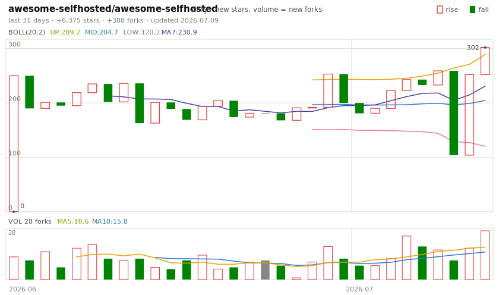
</picture>
</td>
<td valign="top" width="50%">
<b>12 · <a href="https://github.com/996icu/996.ICU">996icu/996.ICU</a></b> — ★ 276,381<br>
<picture>
  <source media="(prefers-color-scheme: dark)" srcset="showcase/996icu-996.ICU/kline-dark.svg">
  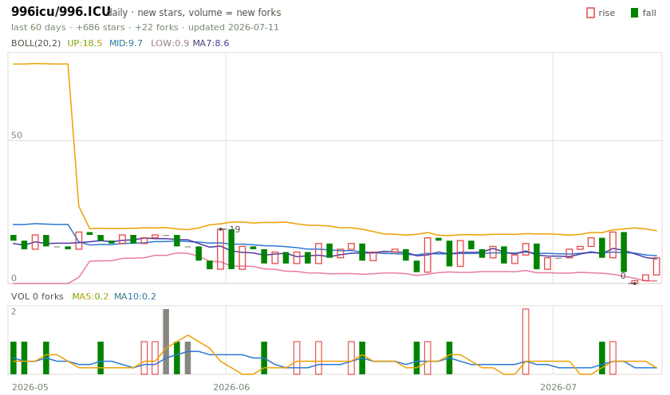
</picture>
</td>
</tr>
<tr>
<td valign="top" width="50%">
<b>13 · <a href="https://github.com/practical-tutorials/project-based-learning">practical-tutorials/project-based-learning</a></b> — ★ 272,810<br>
<picture>
  <source media="(prefers-color-scheme: dark)" srcset="showcase/practical-tutorials-project-based-learning/kline-dark.svg">
  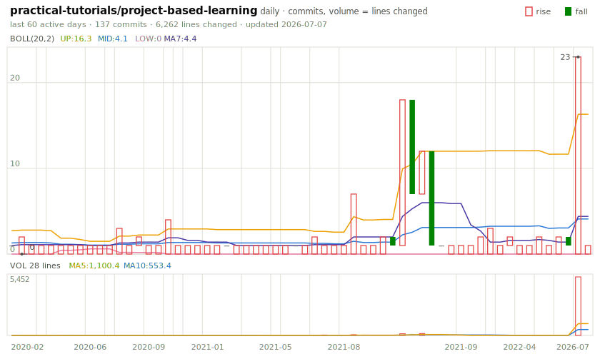
</picture>
</td>
<td valign="top" width="50%">
<b>14 · <a href="https://github.com/obra/superpowers">obra/superpowers</a></b> — ★ 251,894<br>
<picture>
  <source media="(prefers-color-scheme: dark)" srcset="showcase/obra-superpowers/kline-dark.svg">
  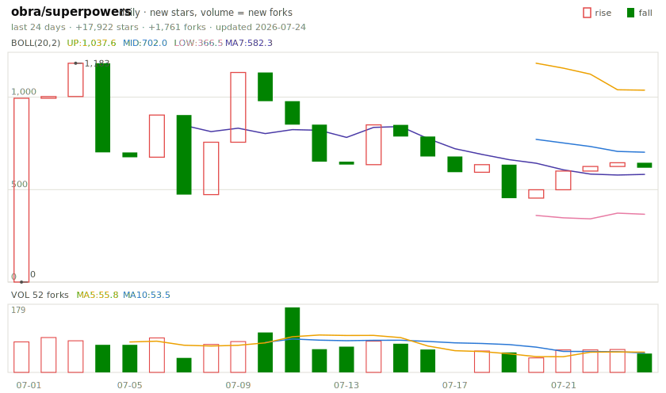
</picture>
</td>
</tr>
<tr>
<td valign="top" width="50%">
<b>15 · <a href="https://github.com/react/react">react/react</a></b> — ★ 246,387<br>
<picture>
  <source media="(prefers-color-scheme: dark)" srcset="showcase/react-react/kline-dark.svg">
  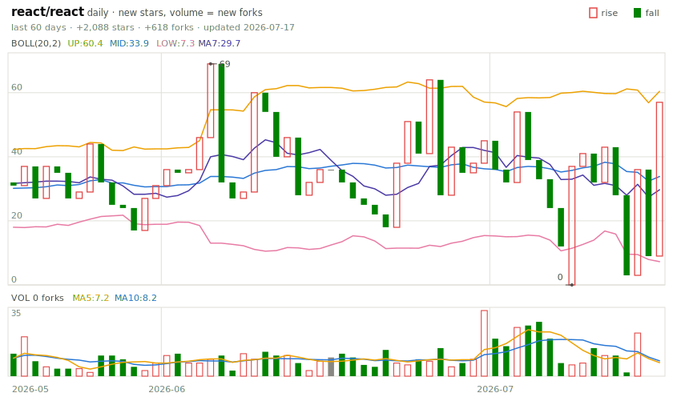
</picture>
</td>
<td valign="top" width="50%">
<b>16 · <a href="https://github.com/torvalds/linux">torvalds/linux</a></b> — ★ 239,126<br>
<picture>
  <source media="(prefers-color-scheme: dark)" srcset="showcase/torvalds-linux/kline-dark.svg">
  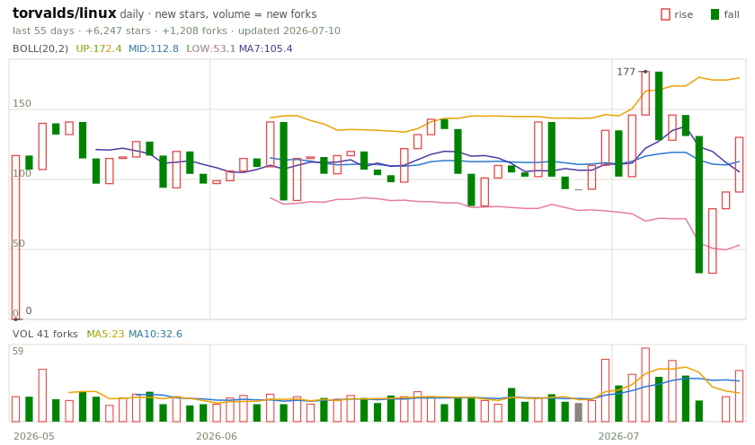
</picture>
</td>
</tr>
<tr>
<td valign="top" width="50%">
<b>17 · <a href="https://github.com/trimstray/the-book-of-secret-knowledge">trimstray/the-book-of-secret-knowledge</a></b> — ★ 232,693<br>
<picture>
  <source media="(prefers-color-scheme: dark)" srcset="showcase/trimstray-the-book-of-secret-knowledge/kline-dark.svg">
  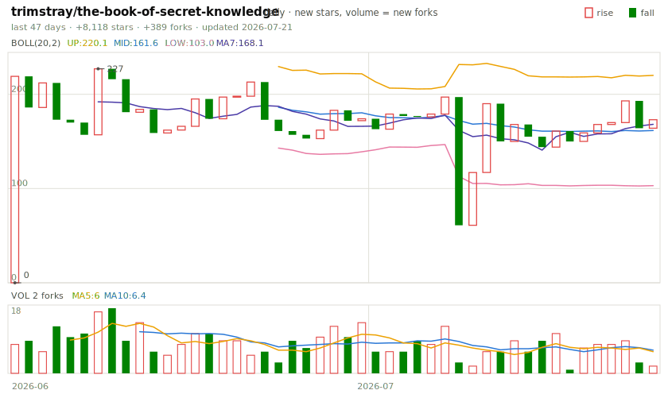
</picture>
</td>
<td valign="top" width="50%">
<b>18 · <a href="https://github.com/affaan-m/ECC">affaan-m/ECC</a></b> — ★ 228,313<br>
<picture>
  <source media="(prefers-color-scheme: dark)" srcset="showcase/affaan-m-ECC/kline-dark.svg">
  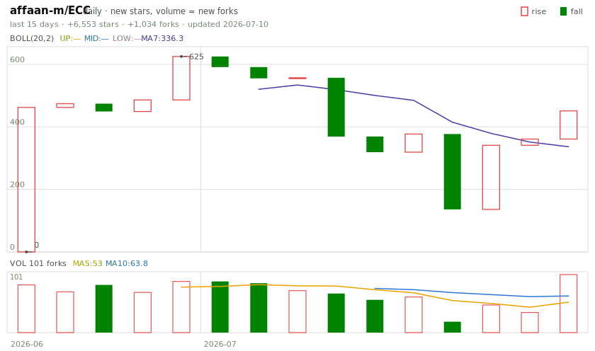
</picture>
</td>
</tr>
<tr>
<td valign="top" width="50%">
<b>19 · <a href="https://github.com/TheAlgorithms/Python">TheAlgorithms/Python</a></b> — ★ 222,549<br>
<picture>
  <source media="(prefers-color-scheme: dark)" srcset="showcase/TheAlgorithms-Python/kline-dark.svg">
  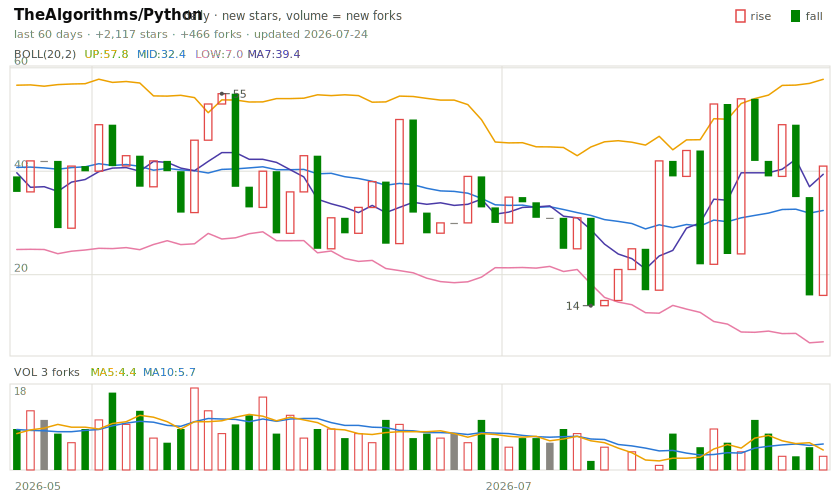
</picture>
</td>
<td valign="top" width="50%">
<b>20 · <a href="https://github.com/NousResearch/hermes-agent">NousResearch/hermes-agent</a></b> — ★ 212,853<br>
<picture>
  <source media="(prefers-color-scheme: dark)" srcset="showcase/NousResearch-hermes-agent/kline-dark.svg">
  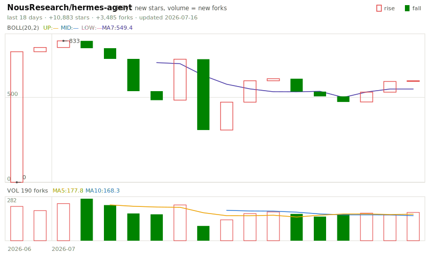
</picture>
</td>
</tr>
</table>
<!-- GDQ20:END -->

---

## 中文速览

把 GitHub 贡献画成**股票日 K 线**挂在个人主页：红涨绿跌（A 股配色）、阳线空心阴线实心、
雪球风格布局（BOLL 布林带 + MA7 均线 + 量柱带均量线）、最高/最低点标注。
收盘 = 今日贡献数，开盘 = 昨日贡献数；无贡献日如休市跳过。
贡献日历只有日粒度，因此主页蜡烛无影线——宁缺毋滥，不编造数据。

接入方法：在你的 profile 仓库（`用户名/用户名`）里按上面第 1、2 步添加 workflow 和
`<picture>` 标签即可，`lang: zh` 可切中文图表文案。也可**按仓库维度**出图：workflow 放进
任意仓库并传 `repo: ${{ github.repository }}`（蜡烛=默认分支全体作者每日 commit、
量柱=变更行数；加 `metric: stars` 切人气口径：蜡烛=每日新增 star、量柱=每日新增 fork）。
本地模式（交互 HTML、仓库文件修改K线、带真实影线）见上节命令。

另设 **GITDAQ-20 指数**（`^GDQ20`，对标纳斯达克 100）：star 市值前 20 的成分仓库，
蜡烛=每日新增 star、量柱=每日新增 fork，见上方指数版块与
[showcase/](showcase/README.md) 明细页，CI 每日重算点位与涨跌。

## License

MIT
